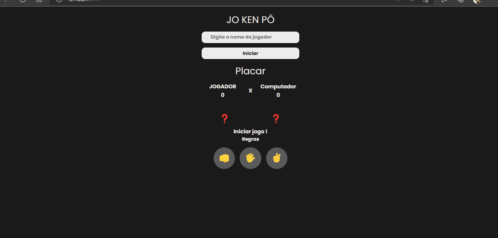

#### Jokenpô é um jogo em que as pessoas jogam com as mãos, escolhendo entre pedra, papel e tesoura.

####  Funciona assim: a tesoura corta o papel, mas quebra com a pedra; o papel embrulha a pedra, mas é cortado pela tesoura e a pedra quebra a tesoura e é embrulhada pelo papel.

#### Pedra = 👊
#### Papel = 🖐️
#### Tesoura = ✌️

[]

### Tecnologias utilizadas

 <!--  -->

  
  

   
   

[ ]